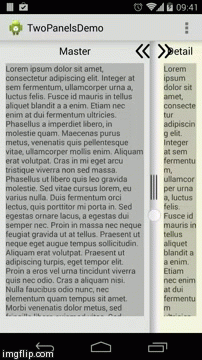

# Welcome to use TwoPanels
------

## What's TwoPanels
This is a [TwoPanels](https://github.com/DesarrolloAntonio/TwoPanels) optimizing project
> TwoPanels is a full customizable library where you can hide and show the fragments in vertical and horizontal and customize the behaviour on orientation changes. The library have a slider separating the fragments, you can drag this slider and the fragments resize the views inside.

## What's News
* update Fragment to v4.Fragment
* suport custom layout
* compile with gradle
* add SliderButton function

## License

This project is under Apache License v2.0. See the [LICENSE](LICENSE) file for full license text.
